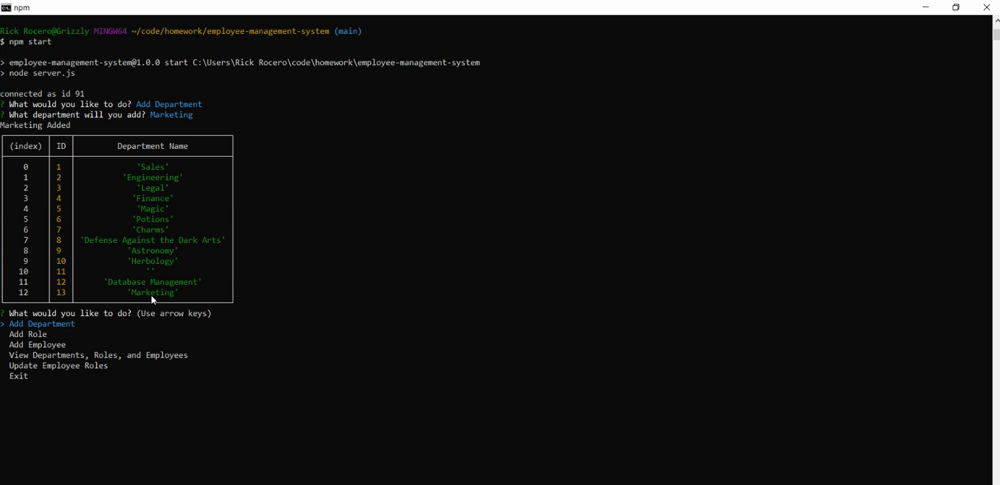

# Employee Management System

## Description
My motivation was to create a employee tracking system using node, inquirer, and MySQL. I built this project to help a business owner keep a record of all their employees and make changes to the employee records. This project will help business owners to be better organized in order to plan their business. This project gave me a deeper understanding on inquirer and helped me to understand how to make MySQL queries to view and update data from node. 
            
## Table of Contents
            
- [Installation](#installation)
- [Usage](#usage)
- [License](#license)
- [Contributing](#contributing)
- [Tests](#tests)
- [Questions](#questions)
            
## Installation
npm install

## Usage
Feel free to fork

## License
None
            
## Contributing
Feel free to contribute
            
## Tests
None
            
## Questions
If you have any questions about the repo, open an issue or contact me directly at rickrocero@gmail.com. You can find more of my work at [rickrocero](https://github.com/rickrocero)
